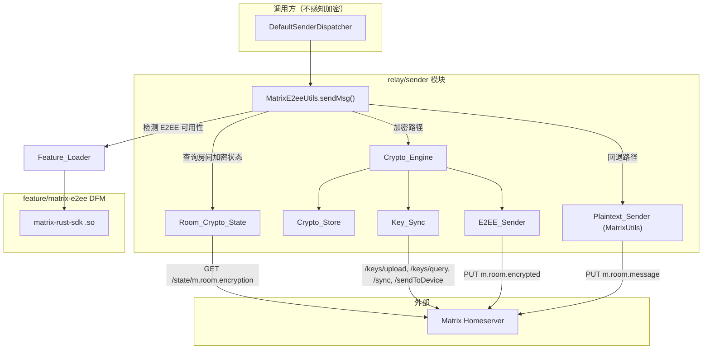
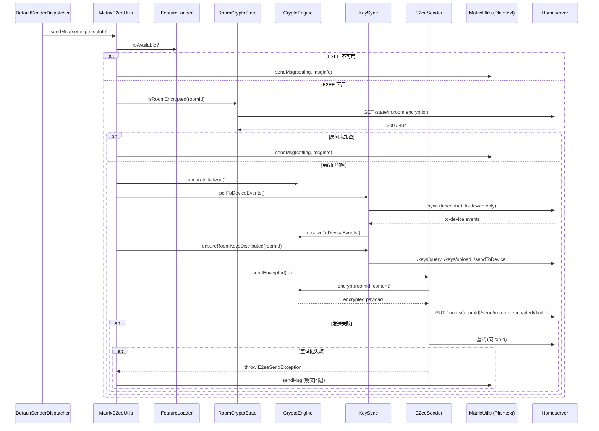
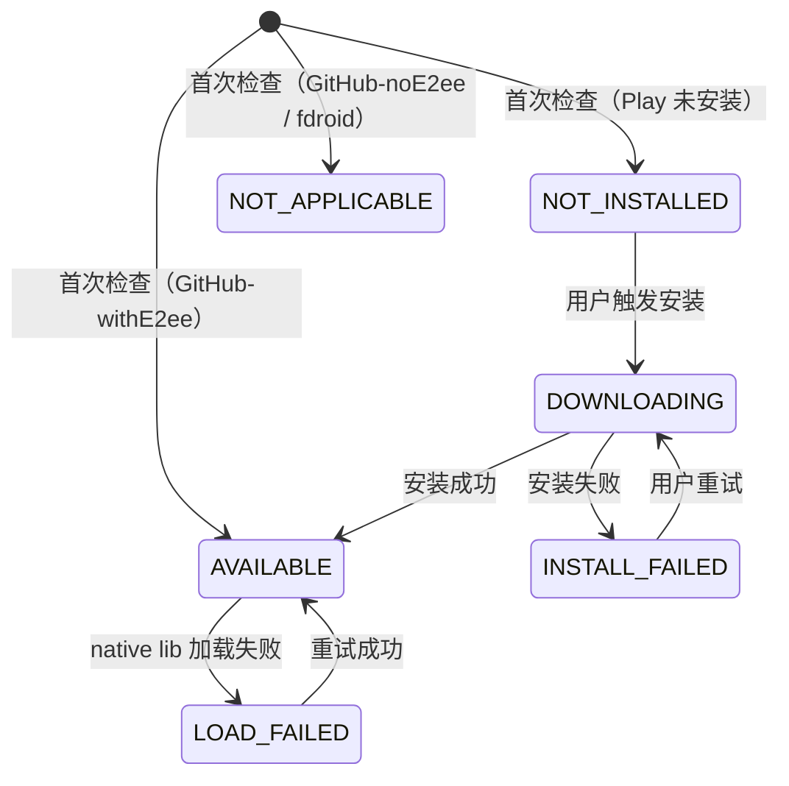

# Design Document: Matrix E2EE 支持

## Overview

为 xinyi-relay 的 Matrix 消息发送通道增加端到端加密（E2EE）能力。设计基于 `matrix-rust-sdk`（`org.matrix.rustcomponents:sdk-android:26.06.3`）提供的 OlmMachine 加密引擎，通过 Olm/Megolm 协议实现消息加密。

核心设计思路：
1. **编译时分化** — 利用已有的 `e2ee` flavor dimension（`withE2ee` / `noE2ee` source sets），在编译时决定是否包含加密实现
2. **运行时路由** — `MatrixE2eeUtils.sendMsg` 作为统一入口，`withE2ee` 变体内部完成 房间加密状态检测 → 密钥同步 → 加密发送 → 失败回退 的完整链路
3. **模块化交付** — Play 版本通过 Dynamic Feature Module 按需下载 native library；GitHub 版本提供 `-e2ee` 后缀 APK 变体（编译时捆绑）
4. **强回退保证** — 任何加密环节失败均透明回退到现有明文 `MatrixUtils.sendMsg`

## Architecture



### 分层职责

| 层次 | 组件 | 职责 |
|------|------|------|
| 入口层 | `MatrixE2eeUtils` | 统一发送入口，路由决策，异常捕获与回退 |
| 状态检测层 | `RoomCryptoState` | 查询 & 缓存房间加密状态 |
| 加密引擎层 | `CryptoEngine` | 管理 OlmMachine 生命周期、加密操作 |
| 持久化层 | `CryptoStore` | 加密状态文件存储（委托给 matrix-rust-sdk 内部 sled/sqlite） |
| 密钥同步层 | `KeySync` | 设备密钥上传、成员密钥查询、to-device 消息处理 |
| 发送层 | `E2eeSender` | 加密消息发送（m.room.encrypted 事件） |
| 回退层 | `MatrixUtils`（Plaintext_Sender） | 已有明文发送逻辑，零修改 |
| 模块加载层 | `FeatureLoader` | 运行时检测/加载 native library 可用性 |

## Components and Interfaces

### 1. RoomCryptoState — 房间加密状态检测

```kotlin
// relay/sender/src/withE2ee/.../RoomCryptoState.kt
internal object RoomCryptoState {
    data class EncryptionInfo(
        val encrypted: Boolean,
        val algorithm: String?,
        val queriedAt: Long // System.currentTimeMillis()
    )

    private val cache = ConcurrentHashMap<String, EncryptionInfo>()
    private const val CACHE_TTL_MS = 60 * 60 * 1000L // 60 minutes
    private const val QUERY_TIMEOUT_MS = 10_000L

    /**
     * 查询 roomId 是否启用 E2EE。
     * - 优先返回缓存（未过期）
     * - 网络异常/非 m.megolm.v1.aes-sha2 算法 → 返回 encrypted=false
     */
    suspend fun isRoomEncrypted(
        homeserver: String,
        accessToken: String,
        roomId: String,
        client: OkHttpClient
    ): Boolean
}
```

**设计决策**：
- 使用内存 `ConcurrentHashMap` 缓存，进程重启自动清空，满足 Requirement 1.6
- TTL 60 分钟后重新查询，满足 Requirement 1.7
- 网络失败 → `encrypted=false` → 走明文路径，满足 Requirement 1.5 的安全回退

### 2. CryptoEngine — 加密引擎

```kotlin
// relay/sender/src/withE2ee/.../CryptoEngine.kt
internal class CryptoEngine(
    private val userId: String,
    private val homeserver: String,
    private val accessToken: String,
    private val storeDir: File
) {
    private lateinit var olmMachine: OlmMachine
    private val initMutex = Mutex()

    /** 初始化或恢复 OlmMachine。首次调用时生成设备密钥。 */
    suspend fun ensureInitialized()

    /** 加密消息内容，返回 m.room.encrypted 事件 payload JSON */
    suspend fun encrypt(roomId: String, eventType: String, content: String): String

    /** 处理 to-device 事件，更新会话状态 */
    suspend fun receiveToDeviceEvents(events: List<String>)

    /** 获取需要发送的 outgoing requests (key uploads, to-device messages, etc.) */
    suspend fun outgoingRequests(): List<Request>

    /** 标记 outgoing request 已完成 */
    suspend fun markRequestAsSent(requestId: String, responseBody: String)

    /** 关闭并释放资源 */
    fun close()
}
```

**设计决策**：
- 使用 `matrix-rust-sdk` 的 `OlmMachine` 作为底层实现，避免手动管理 Olm/Megolm 会话
- `OlmMachine` 内部已包含 Crypto_Store 功能（基于 SQLite），通过 `storeDir` 参数指定持久化路径
- 存储路径: `{appFilesDir}/matrix-crypto/{sha256(userId).take(16)}/`，按用户隔离
- 初始化超时 30 秒；失败时删除损坏存储并重新初始化（Requirement 2.5）

### 3. KeySync — 密钥同步

```kotlin
// relay/sender/src/withE2ee/.../KeySync.kt
internal class KeySync(
    private val engine: CryptoEngine,
    private val homeserver: String,
    private val accessToken: String,
    private val client: OkHttpClient
) {
    private var syncToken: String? = null // persisted alongside crypto store

    /** 执行一次 /sync 拉取 to-device 事件（timeout=0，非阻塞） */
    suspend fun pollToDeviceEvents()

    /** 处理 OlmMachine 产生的所有 outgoing requests */
    suspend fun processOutgoingRequests()

    /** 上传设备密钥和 one-time keys（如果需要） */
    suspend fun uploadKeysIfNeeded()

    /** 查询房间成员设备密钥并分发群组密钥 */
    suspend fun ensureRoomKeysDistributed(roomId: String)
}
```

**设计决策**：
- `/sync` 使用 `timeout=0` 非阻塞轮询，只获取 to-device 事件（filter 排除 room/presence/account_data）
- `syncToken` 持久化到与 crypto store 同目录的文件中
- key upload 在每次发送前检查一次；one-time key count < 25 时补充到 50
- 网络失败不阻塞发送流程，使用现有会话状态继续

### 4. E2eeSender — 加密消息发送

```kotlin
// relay/sender/src/withE2ee/.../E2eeSender.kt
internal object E2eeSender {
    private const val SEND_TIMEOUT_MS = 30_000L

    /**
     * 加密并发送消息到指定房间。
     * @throws E2eeEncryptionException 加密失败
     * @throws E2eeSendException HTTP 发送失败（重试一次后仍失败）
     */
    suspend fun sendEncrypted(
        setting: MatrixSetting,
        roomId: String,
        messageContent: String,
        engine: CryptoEngine,
        keySync: KeySync,
        client: OkHttpClient
    )
}
```

**设计决策**：
- txnId 格式: `xinyi-e2ee-{UUID}`，确保幂等性
- 发送失败重试一次（使用相同 txnId），再失败则抛异常由上层捕获回退
- 密钥分发失败（部分设备不可达）不阻止发送，记录警告日志

### 5. FeatureLoader — 动态模块加载

```kotlin
// relay/sender/api/.../FeatureLoader.kt (接口定义在 api 模块)
interface MatrixE2eeAvailability {
    val isAvailable: Boolean
    val status: E2eeModuleStatus
}

enum class E2eeModuleStatus {
    AVAILABLE,          // 模块已加载可用
    NOT_INSTALLED,      // Play: 未安装 / GitHub-default: 不含该模块
    DOWNLOADING,        // Play: 下载中
    INSTALL_FAILED,     // Play: 安装失败
    LOAD_FAILED,        // 已安装但加载失败
    NOT_APPLICABLE      // fdroid 等不支持的 flavor
}

// relay/sender/src/play/.../PlayFeatureLoader.kt
// relay/sender/src/github/.../GithubFeatureLoader.kt
```

**设计决策**：
- Play 版本：通过 `SplitInstallManager` 请求 `matrix-e2ee` 模块安装，监听进度回调
- GitHub-withE2ee 变体：编译时捆绑，启动时通过 `Class.forName` 检测 `MatrixE2eeFeature` 是否可加载来判断可用性
- GitHub-noE2ee 变体：直接报告不可用
- 接口定义在 `relay/sender/api` 模块，便于 UI 层查询状态

### 6. MatrixE2eeUtils（withE2ee 变体）— 路由入口

```kotlin
// relay/sender/src/withE2ee/.../MatrixE2eeUtils.kt
object MatrixE2eeUtils {
    suspend fun sendMsg(setting: MatrixSetting, msgInfo: MsgInfo) {
        // 1. 检查 Feature_Loader → E2EE 不可用则直接明文发送
        // 2. 查询 RoomCryptoState → 房间未加密则明文发送
        // 3. 初始化 CryptoEngine（懒加载，复用实例）
        // 4. KeySync.pollToDeviceEvents() → 更新会话状态
        // 5. KeySync.ensureRoomKeysDistributed(roomId)
        // 6. E2eeSender.sendEncrypted(...)
        // 7. 任何异常 → catch → log → MatrixUtils.sendMsg(setting, msgInfo) 明文回退
    }
}
```

### 组件交互时序图



## Data Models

### 加密事件 Payload（m.room.encrypted）

```json
{
  "algorithm": "m.megolm.v1.aes-sha2",
  "sender_key": "<设备 Curve25519 公钥>",
  "session_id": "<Megolm 出站会话 ID>",
  "device_id": "<发送设备 ID>",
  "ciphertext": "<Base64 编码的 Megolm 密文>"
}
```

### RoomCryptoState 缓存条目

```kotlin
data class EncryptionInfo(
    val encrypted: Boolean,
    val algorithm: String?,     // "m.megolm.v1.aes-sha2" or null
    val queriedAt: Long         // epoch millis
)
```

### Crypto_Store 目录结构

```
{appFilesDir}/
└── matrix-crypto/
    └── {sha256(userId).take(16)}/
        ├── matrix-sdk-crypto.sqlite   // OlmMachine 内部管理
        └── sync_token.txt             // 上次 /sync 的 since token
```

### Feature_Loader 状态机



### Build System 变体矩阵

| distribution × e2ee | 产出 | E2EE 行为 |
|---|---|---|
| play × noE2ee | AAB (Play Store) | DFM 按需下载 |
| play × withE2ee | ❌ 禁用 | — |
| github × noE2ee | APK (默认) | 不含 E2EE，纯明文 |
| github × withE2ee | APK (-e2ee 后缀) | 编译时捆绑 native lib |
| fdroid × * | ❌ 禁用 | — |

### GitHub E2EE 变体构建差异

- `github × withE2ee` 变体的 `relay/sender` 模块编译 `src/withE2ee/` 源集
- `feature/matrix-e2ee` DFM 仅由 `play` flavor 的 `:app` 引用
- GitHub-withE2ee APK 通过 `relay/sender` 的 `withE2eeImplementation` 依赖直接获得 `sdk-android` 的 native libraries（arm64-v8a）
- 文件名规则: `XinyiRelay_v{version}_e2ee_{buildType}.apk`

## Correctness Properties

*A property is a characteristic or behavior that should hold true across all valid executions of a system — essentially, a formal statement about what the system should do. Properties serve as the bridge between human-readable specifications and machine-verifiable correctness guarantees.*

### Property 1: 房间加密状态分类正确性

*For any* HTTP response to a `GET /rooms/{roomId}/state/m.room.encryption` request, the room SHALL be classified as encryption-enabled if and only if the response is HTTP 200 with a JSON body containing `algorithm` equal to `"m.megolm.v1.aes-sha2"`. All other conditions (non-200 status, missing algorithm field, different algorithm value, malformed JSON, timeout) SHALL result in encryption-disabled classification.

**Validates: Requirements 1.2, 1.3, 1.4, 1.5**

### Property 2: 房间加密状态缓存 TTL 行为

*For any* room ID with a cached encryption status entry, if the entry's age is less than 60 minutes, subsequent queries SHALL return the cached value without network access. If the entry's age is 60 minutes or greater, the next query SHALL trigger a fresh network request and update the cache with the new result.

**Validates: Requirements 1.6, 1.7**

### Property 3: Crypto_Store 路径派生确定性

*For any* valid userId string, the derived store directory path SHALL always equal `{appFilesDir}/matrix-crypto/{sha256(userId).substring(0, 16)}/`, and the derivation SHALL be a pure deterministic function (same input always produces same output).

**Validates: Requirements 2.2**

### Property 4: One-Time Key 补充阈值

*For any* one-time key count value reported by the homeserver, if the count is less than 25 the system SHALL trigger an upload to restore the count to 50. If the count is 25 or greater, no upload SHALL be triggered.

**Validates: Requirements 3.3**

### Property 5: 加密事件 URL 构造

*For any* valid (homeserver, roomId, txnId) triple, the constructed send URL SHALL be of the form `{normalizedHomeserver}/_matrix/client/v3/rooms/{roomId}/send/m.room.encrypted/{txnId}`, where normalizedHomeserver is trimmed and has no trailing slash.

**Validates: Requirements 4.2**

### Property 6: 加密事件 Payload 结构完整性

*For any* encrypted message output produced by CryptoEngine.encrypt(), the resulting JSON payload SHALL contain all four required fields: `sender_key`, `session_id`, `device_id`, and `ciphertext`, each with a non-empty string value.

**Validates: Requirements 4.4**

### Property 7: 重试保持 txnId 幂等性

*For any* message send attempt where the first HTTP PUT fails, the subsequent retry SHALL use the exact same txnId as the original request, ensuring idempotent delivery semantics.

**Validates: Requirements 4.6**

### Property 8: 发送路由决策

*For any* message send invocation with state (e2eeAvailable: Boolean, roomEncrypted: Boolean), the routing decision SHALL be: use E2EE path if and only if both e2eeAvailable AND roomEncrypted are true; otherwise use Plaintext path. This evaluation SHALL occur fresh on each invocation (not cached from prior calls).

**Validates: Requirements 5.1, 5.2, 8.2, 8.3, 8.4, 8.5**

### Property 9: 明文回退保持消息内容不变

*For any* message content that triggers a plaintext fallback due to encryption failure, the content passed to Plaintext_Sender (MatrixUtils.sendMsg) SHALL be byte-for-byte identical to the original message content provided by the caller.

**Validates: Requirements 5.3**

### Property 10: to-device 事件处理先于加密操作

*For any* encrypted message send operation, the to-device event polling and processing step SHALL complete before the message encryption step begins, ensuring the latest session state is used for encryption.

**Validates: Requirements 9.4**

## Error Handling

### 错误分类与处理策略

| 错误场景 | 影响范围 | 处理策略 | 日志级别 |
|----------|----------|----------|----------|
| 房间状态查询超时/失败 | 单条消息 | 视为未加密，走明文路径 | WARN |
| CryptoEngine 初始化失败 | 所有加密操作 | 回退明文；允许下次重试 | ERROR |
| Crypto_Store 损坏 | 所有加密操作 | 删除存储目录，重新初始化 | WARN |
| 设备密钥上传失败 | 当前消息 | 回退明文；下次发送时重试上传 | WARN |
| /keys/query 失败 | 当前消息 | 回退明文 | WARN |
| Megolm 加密失败 | 当前消息 | 回退明文 | ERROR |
| 加密消息 HTTP PUT 失败 | 当前消息 | 重试一次（同 txnId），仍失败则回退明文 | WARN |
| 部分设备密钥分发失败 | 特定设备 | 继续发送（部分设备可解密），记录不可达设备列表 | WARN |
| /sync to-device 拉取失败 | 会话状态可能过时 | 使用现有状态继续加密，不阻塞 | WARN |
| DFM 下载失败 (Play) | E2EE 不可用 | 报告 UI，允许重试，继续明文 | ERROR |
| Native library 加载失败 | E2EE 不可用 | 报告不可用，回退明文 | ERROR |
| Plaintext 发送失败（回退后） | 消息投递 | 传播异常给调用方，不再重试 | ERROR |

### 回退链路

```
E2EE 加密发送
  ↓ (任何加密环节失败)
明文发送 (MatrixUtils.sendMsg)
  ↓ (明文发送也失败)
传播异常给 DefaultSenderDispatcher → 返回失败结果给调用方
```

### 超时配置

| 操作 | 超时时长 | 备注 |
|------|----------|------|
| 房间状态查询 | 10 秒 | OkHttp connectTimeout + readTimeout |
| CryptoEngine 初始化 | 30 秒 | 包含磁盘 I/O 和 SDK 初始化 |
| 加密操作 | 30 秒 | 包含密钥同步和加密计算 |
| 加密消息 HTTP 发送 | 30 秒 | 单次 PUT 请求 |
| /sync to-device 轮询 | timeout=0（立即返回） | 非阻塞 |

## Testing Strategy

### 单元测试（Example-Based）

针对特定场景和边缘情况：

1. **RoomCryptoState 解析逻辑**
   - 404 响应 → 返回未加密
   - 有效 JSON 但缺少 algorithm 字段 → 返回未加密
   - Crypto_Store 损坏恢复（文件写入垃圾后重新初始化）

2. **错误回退路径**
   - CryptoEngine 初始化失败 → 明文回退
   - 加密操作抛异常 → 明文回退
   - 明文回退后 Plaintext 也失败 → 异常传播
   - /keys/query 失败 → 明文回退
   - /sync 失败 → 继续加密（不阻塞）

3. **Feature_Loader 行为**
   - Play: SplitInstallManager 调用验证
   - GitHub-noE2ee: 直接报告不可用
   - GitHub-withE2ee: 检测到 native lib 报告可用
   - Module 安装后类加载成功
   - Module 加载失败 → 报告错误

4. **UI 状态显示**
   - 各种 E2eeModuleStatus 对应正确的 Compose 组件渲染

### 属性测试（Property-Based）

使用 `io.kotest:kotest-property` 库（Kotlin 生态成熟的 PBT 框架）。

**配置**：每个属性测试最少运行 100 次迭代。

每个属性测试需标注对应设计文档 Property：

```kotlin
// Tag format: Feature: matrix-e2ee-support, Property {N}: {title}
```

**属性测试覆盖范围**：
- Property 1: 生成随机 HTTP 状态码 + 随机 JSON body → 验证分类逻辑
- Property 2: 生成随机时间戳和房间 ID → 验证缓存命中/过期行为
- Property 3: 生成随机 userId 字符串 → 验证路径确定性
- Property 4: 生成 0-100 随机 OTK count → 验证阈值行为
- Property 5: 生成随机 homeserver URL / roomId / txnId → 验证 URL 格式
- Property 6: 验证加密输出 JSON 结构（需 mock CryptoEngine 返回随机合法密文结构）
- Property 7: 生成随机 txnId → 模拟失败重试 → 验证 txnId 不变
- Property 8: 穷举 (true/false, true/false) 四种组合 → 验证路由决策
- Property 9: 生成随机长度/内容的消息 → 触发回退 → 验证内容不变
- Property 10: 通过执行顺序追踪验证 to-device 处理先于 encrypt 调用

### 集成测试

使用 mock HTTP server（如 MockWebServer）模拟 homeserver：

1. 完整加密发送链路（初始化 → 密钥同步 → 加密 → 发送）
2. Play DFM 安装流程（mock SplitInstallManager）
3. 多消息连续发送（验证会话复用）
4. 首次初始化后重启恢复（验证持久化）

### 构建验证（Smoke）

- `assembleGithubWithE2eeDebug` 产出 APK 包含 arm64-v8a native lib
- `assembleGithubNoE2eeDebug` 产出 APK 不包含 native lib
- APK 文件名包含/不包含 `_e2ee` 后缀
- 两个变体的 `MatrixE2eeUtils.sendMsg` 签名兼容 `DefaultSenderDispatcher` 调用

