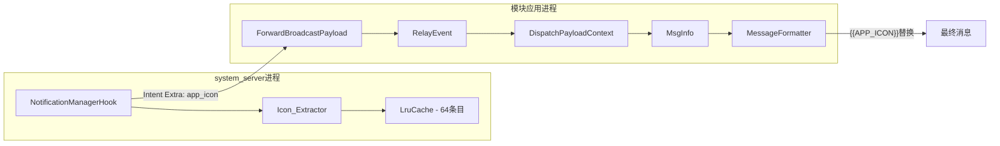

# 设计文档

## Overview

本设计为 xinyi-relay Xposed 模块增加通知来源应用图标提取能力。通过在 Hook 层（system_server 进程）中利用 PackageManager 获取应用图标，将其编码为 Base64 PNG 字符串，经 IPC 传递至模块应用进程，最终通过 `{{APP_ICON}}` 模板变量暴露给用户的自定义消息模板。

核心设计原则：
- **优雅降级**：图标提取失败时返回空字符串，不影响通知转发主流程
- **内存可控**：使用 LruCache(64) + 48×48 固定尺寸，内存上限约 320KB
- **层次透传**：appIcon 字段沿现有数据管道透传，不改变现有架构

## Architecture



> **注：** MessageFormatter 通过 MsgInfo 获取 appIcon 数据。数据流路径为 RelayEvent → DispatchPayloadContext → MsgInfo → MessageFormatter。MessageFormatter 并不直接从 RelayEvent 读取 appIcon，而是通过 MsgInfo 间接获得。

数据流路径：
1. **Hook 层**：`NotificationManagerHook` 拦截通知 → 调用 `resolveAppIconBase64(pm, pkg)` → 查询/写入 `LruCache`
2. **IPC 层**：Base64 字符串作为 Intent Extra (`"app_icon"`) 发送至模块进程
3. **事件模型层**：`ForwardBroadcastPayload.fromIntent()` → `RelayEvent` → `MsgInfo` 逐层传递 `appIcon` 字段
4. **模板层**：`MessageFormatter` 将 `{{APP_ICON}}` 替换为 `appIcon` 值

## Components and Interfaces

### 1. Icon_Extractor（Hook 层）

位于 `NotificationManagerHook.kt`，负责图标的提取和编码。

```kotlin
// 类级缓存
private val appIconCache = android.util.LruCache<String, String>(64)

// 主入口方法
private fun resolveAppIconBase64(pm: PackageManager, packageName: String): String

// 编码辅助方法
private fun encodeDrawableToBase64Png(drawable: Drawable, targetSize: Int): String
```

**接口契约：**
- `resolveAppIconBase64` 永不抛出异常，失败时返回空字符串
- `encodeDrawableToBase64Png` 将任意 Drawable 渲染到固定尺寸 Bitmap 并编码
- 支持所有 Drawable 子类型（BitmapDrawable、VectorDrawable、AdaptiveIconDrawable）

### 2. IPC 常量扩展

位于 `ForwardBroadcastContract.kt`：

```kotlin
const val EXTRA_APP_ICON = "app_icon"
```

`populatePayload()` 方法新增 `appIcon` 参数。

### 3. ForwardBroadcastPayload 扩展

```kotlin
data class ForwardBroadcastPayload(
    // ... 现有字段
    val appIcon: String = "",  // 新增
)
```

- `fromIntent()`：解析 `EXTRA_APP_ICON`，缺失时默认空字符串
- `toRelayEvent()`：传递 `appIcon` 到 RelayEvent
- `toIntent()`：通过 `populatePayload` 写入 Intent Extra

### 4. 事件模型扩展

**RelayEvent.kt：**
```kotlin
data class RelayEvent(
    // ... 现有字段
    val appIcon: String = "",  // 新增
)
```

**MsgInfo.kt：**
```kotlin
data class MsgInfo(
    // ... 现有字段
    val appIcon: String = "",  // 新增
)
```

**DispatchPayloadContext.kt：**
`toMsgInfo()` 中新增：`appIcon = event.appIcon`

### 5. MessageFormatter 模板变量

在 `variables` map 中注册：
```kotlin
"APP_ICON" to event.appIcon,
```

## Data Models

### 数据字段传递链

| 层 | 载体 | 字段名 | 类型 | 默认值 |
|---|---|---|---|---|
| Hook → IPC | Intent Extra | `"app_icon"` | String | 无（不存在则解析为空字符串） |
| IPC 解析 | ForwardBroadcastPayload | `appIcon` | String | `""` |
| 事件模型 | RelayEvent | `appIcon` | String | `""` |
| 消息模型 | MsgInfo | `appIcon` | String | `""` |
| 模板引擎 | MessageFormatter variables | `"APP_ICON"` | String | `""` |

### Base64 编码数据规格

- **输入**：任意 `Drawable`（来自 `PackageManager.getApplicationIcon()`）
- **渲染尺寸**：48×48 像素
- **Bitmap 配置**：`ARGB_8888`（每像素 4 字节，原始 9,216 字节）
- **压缩格式**：PNG，quality=100（无损）
- **编码方式**：`Base64.NO_WRAP`（无换行符）
- **典型输出大小**：3-5 KB（因 PNG 压缩，实际小于原始 Bitmap）

### LruCache 配置

- **键**：`String`（packageName）
- **值**：`String`（Base64 编码结果）
- **最大容量**：64 条目
- **内存估算**：64 × ~5KB ≈ 320KB 上限
- **不缓存项**：空字符串（提取失败的结果）

## Correctness Properties

*属性是在系统所有有效执行中都应成立的特征或行为——本质上是关于系统应该做什么的形式化陈述。属性充当了人类可读规范与机器可验证正确性保证之间的桥梁。*

### Property 1: Bitmap 渲染尺寸不变量

*For any* 有效的 Drawable 输入，`encodeDrawableToBase64Png` 创建的 Bitmap 应始终为 48×48 像素、ARGB_8888 配置。

**Validates: Requirements 1.2, 7.2**

### Property 2: Base64 PNG 编码往返正确性

*For any* 有效的 48×48 ARGB_8888 Bitmap，将其压缩为 PNG 并 Base64 编码后，对结果进行 Base64 解码再 PNG 解码，应得到一个 48×48 的有效 Bitmap。

**Validates: Requirements 1.3**

### Property 3: 缓存读写一致性

*For any* 非空 Base64 字符串和任意 packageName，将其存入 Icon_Cache 后立即读取，应返回完全相同的字符串。

**Validates: Requirements 2.2, 2.3**

### Property 4: 缓存容量不变量

*For any* 插入操作序列，Icon_Cache 的条目数量永远不超过 64。

**Validates: Requirements 2.1**

### Property 5: LRU 淘汰正确性

*For any* 已满（64 条目）的 Icon_Cache，插入一个新的 packageName 后，最近最少使用的条目应被淘汰，且该被淘汰条目不可再通过 get 获取。

**Validates: Requirements 2.4**

### Property 6: 空结果不缓存

*For any* packageName，若图标提取返回空字符串，Icon_Cache 中不应存在该 packageName 的缓存条目。

**Validates: Requirements 2.5**

### Property 7: appIcon 数据流透传保持

*For any* Base64 字符串作为 appIcon，从 Intent Extra 解析经 ForwardBroadcastPayload → RelayEvent → MsgInfo 的完整数据流路径中，appIcon 值应保持不变。

**Validates: Requirements 3.2, 3.3, 4.3**

### Property 8: 模板变量替换正确性

*For any* 非空 appIcon 字符串和包含 `{{APP_ICON}}` 的消息模板，MessageFormatter 格式化后的输出应包含该 appIcon 字符串且不再包含 `{{APP_ICON}}` 占位符。

**Validates: Requirements 5.2**

### Property 9: 异常不传播不变量

*For any* 异常（包括 OOM、NPE、SecurityException）在 resolveAppIconBase64 执行过程中抛出，该方法应返回空字符串且不向调用方传播异常。

**Validates: Requirements 1.4, 1.5**

### Property 10: 空 appIcon 对消息格式无副作用

*For any* 消息模板和空 appIcon 字符串，格式化后的输出不应包含 `{{APP_ICON}}` 占位符，且模板中仅含 `{{APP_ICON}}` 的行应被移除。

**Validates: Requirements 5.3, 5.4**

## Error Handling

### 图标提取失败场景

| 失败点 | 可能原因 | 处理方式 |
|---|---|---|
| `PackageManager.getApplicationIcon()` | NameNotFoundException（应用已卸载）、SecurityException | 捕获异常，返回空字符串 |
| `Drawable.draw()` | NullPointerException、OutOfMemoryError | `runNonFatalOrNull` 包裹，返回空字符串 |
| `Bitmap.compress()` | IOException | `runNonFatalOrNull` 包裹，返回空字符串 |
| `Base64.encodeToString()` | OutOfMemoryError（极端情况） | `runNonFatalOrNull` 包裹，返回空字符串 |

### 降级策略

- 所有异常通过 `runNonFatalOrNull` 统一捕获，不区分异常类型
- 提取失败的结果（空字符串）不写入缓存，下次通知仍会重试
- `{{APP_ICON}}` 模板变量在 appIcon 为空时被替换为空字符串
- MessageFormatter 的 `removeEmptyValueLines` 逻辑会自动清除仅包含空 APP_ICON 值的行

### Bitmap 资源管理

- `encodeDrawableToBase64Png` 在编码完成后立即调用 `bitmap.recycle()`
- 使用 `try-finally` 确保即使编码过程抛出异常，Bitmap 也能被回收

### LruCache 并发说明

LruCache 本身是线程安全的，但 `resolveAppIconBase64` 中 get + put 的 check-then-act 模式在并发场景下可能导致同一 packageName 的图标被重复编码。由于编码结果是确定性的（相同 Drawable → 相同 Base64），重复编码不影响正确性，仅造成极少量的一次性性能浪费，无需额外同步。

## Testing Strategy

### 属性测试（Property-Based Testing）

使用 **Kotest** 框架的 property testing 模块（`kotest-property`），每个属性测试至少运行 100 次迭代。

**适用属性：**
- Property 1-2：Bitmap 渲染和 Base64 编码的正确性
- Property 3-6：LruCache 行为的正确性
- Property 8：模板替换
- Property 9：异常不传播不变量
- Property 10：空 appIcon 对消息格式无副作用

> **注：** Property 7（appIcon 数据流透传保持）因涉及多层对象转换（ForwardBroadcastPayload → RelayEvent → MsgInfo），多层 mock 使属性测试难以实施，改为集成测试验证。

**标签格式：** `Feature: notification-icon-extraction, Property {number}: {property_text}`

### 单元测试（Example-Based）

| 测试场景 | 验证内容 |
|---|---|
| `encodeDrawableToBase64Png` + ColorDrawable | 输出是合法 Base64 字符串，可解码为 PNG |
| `resolveAppIconBase64` + 异常 PM | 返回空字符串，不抛出异常 |
| `ForwardBroadcastPayload.fromIntent()` 无 app_icon extra | appIcon 默认为空字符串 |
| `MessageFormatter` + 空 appIcon | `{{APP_ICON}}` 被替换为空，含空值的行被移除 |
| `MessageFormatter` + 有效 appIcon | `{{APP_ICON}}` 被正确替换 |
| AdaptiveIconDrawable 渲染 | 输出非空 Base64 字符串 |
| Bitmap.recycle() 调用验证 | 编码完成后 Bitmap 已被回收 |

### 集成测试

| 测试场景 | 验证内容 |
|---|---|
| 端到端 Intent 传递 | app_icon extra 从 Hook 侧经 IPC 正确到达模板引擎 |
| LruCache 跨多次通知 | 第二次相同 packageName 命中缓存，不重新编码 |
| appIcon 数据流透传（Property 7） | 任意 Base64 字符串从 Intent Extra 经 ForwardBroadcastPayload → RelayEvent → MsgInfo 完整链路传递后值不变 |

### 手动验证

- 安装新版模块 → 触发应用通知（微信/QQ 等）
- logcat 检查 `app_icon` Intent Extra 长度 >100（有效 Base64）
- Webhook 模板使用 `{{APP_ICON}}`，确认请求 body 携带 Base64 数据
- 无图标系统服务通知 → `{{APP_ICON}}` 为空，转发不受影响
