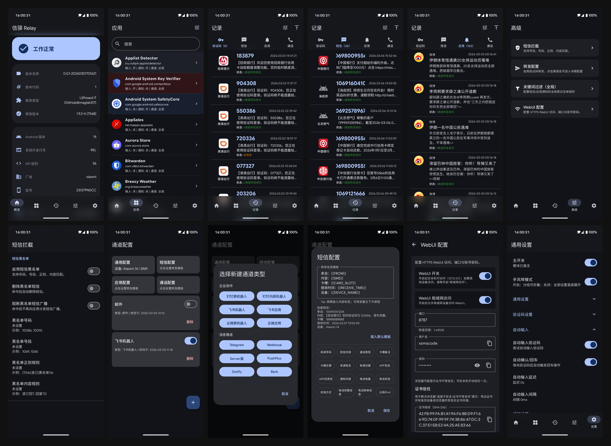
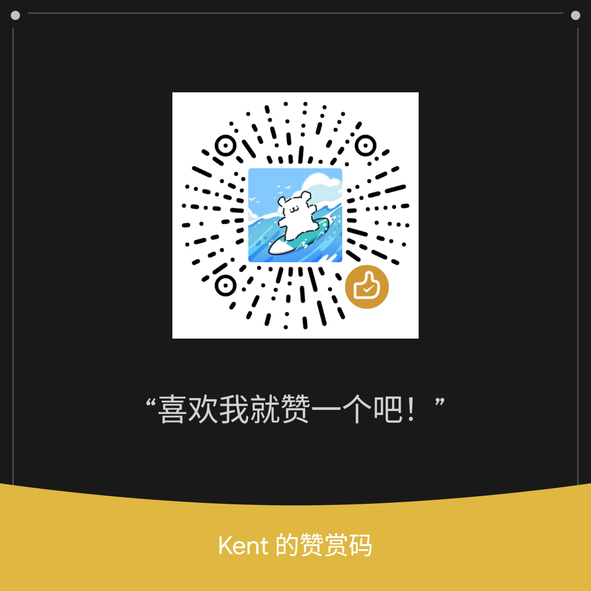

# Xinyi Relay

    
    

<!-- badges:platform:start -->
   
<!-- badges:platform:end -->

<!-- badges:tech:start -->
        
<!-- badges:tech:end -->

Xinyi Relay is a relay and verification-code autofill project for Xposed/LSPosed, with unified handling for SMS, app notifications, and incoming call events.

The project now ships in three major parts:

- Android App: local event capture, verification parsing, autofill, and Xposed hooks
- Backend: device binding, per-device config mirrors and command queues, record upload, and cloud Web console
- Desktop App: cross-platform management tool with a built-in local SQLite database, supporting standalone offline execution and cloud sync

The old embedded WebUI has been retired from the Android runtime path. The current official architecture is `Android Agent + Backend / Desktop` working collectively.

[中文版本](./README.md)

# Screenshots

# Communication & Feedback
- [Telegram Group](https://t.me/+NR2QaQ4dlEgxYmNl)

## Android App

The Android app is the on-device module for Xposed/LSPosed. It is responsible for local event capture, verification parsing, autofill, and runtime hooks.

### Install & Use
1. Root your device and install LSPosed/Xposed.
2. Install Xinyi Relay:
   - GitLab Releases: APK downloads
   - Google Play: Store distribution
3. Enable the module and reboot.
4. Configure sender channels, routing rules, filters, and verification-code autofill policies.

### Compatibility
- Minimum Android 8.0 (API 26).
- Designed for AOSP-like systems; heavily customized ROMs may have compatibility issues.

### Core Features
- SMS relay: relay verification SMS and plain SMS with rules
- App notification relay: bind apps to sender channels
- Call-event relay: capture and relay incoming-call metadata
- Global and app-level filtering: keywords, sources, priorities, and forward filters
- Verification code parsing, copy, and autofill
- Verification-code rules: bundled official read-only rules, refreshable cache, and user custom rules are merged in layers
- Records and backup: export/import config and history

## Backend

The Backend is the self-hosted remote control plane for Xinyi Relay, with a local-first deployment model and optional public access.

### Stack
- Go API
- PostgreSQL
- Caddy
- Web console

### Default Deployment
- Docker Compose pulls `docker.io/alpha317/xinyi-relay-backend:beta` by default
- Android Agent, Web, and Desktop share the same backend API
- Local HTTPS uses Caddy `tls internal`, with user CA installation available for Android Agent

### Entry Docs
- [Backend Guide](backend/README.md)
- [Backend API Overview](backend/API_OVERVIEW.md)
- [Desktop Guide](frontend/desktop/README.md)

### Log Locations

Both Backend and Desktop support log file output for troubleshooting:

- **Backend Docker**: `backend/logs/backend.log` (configure `RELAY_LOG_FILE` in `.env`)
- **Desktop**:
  - macOS: `~/Library/Logs/io.github.magisk317.relay.desktop/`
  - Windows: `%APPDATA%\io.github.magisk317.relay.desktop\logs\`
  - Linux: `~/.local/share/io.github.magisk317.relay.desktop/logs/`

See each component's README for details.

## Desktop

The Desktop app is a cross-platform management tool built with Tauri + Rust (available on macOS / Windows / Linux). It has been upgraded to a **fully-featured client**, supporting three distinct modes:

- **Local Mode**: Runs completely offline, using its built-in SQLite database to manage devices, configs, and history records for maximum privacy.
- **Remote Mode**: Acts as a traditional thin client, connecting directly to your self-hosted Backend instance.
- **Hybrid Mode**: Prioritizes ultra-fast local response times, seamlessly syncing bidirectionally with the Backend instance when needed.

## Desktop Release Notes

- Desktop releases currently ship Linux, macOS, and Windows packages.
- macOS builds are currently distributed unsigned, so first launch may require a manual allow step in system settings.
- Windows builds are signed with the repository-managed self-signed certificate. If Windows blocks the installer, import the public certificate [frontend/desktop/certs/windows-codesign.cer](frontend/desktop/certs/windows-codesign.cer) first and then retry the installer.
- This Windows certificate is only intended for niche distribution of this project. It is not a public CA commercial code-signing certificate, so only import it if you trust this project's releases.

Feedback and suggestions are welcome.

# Documentation
- [Release Logs](docs/CHANGELOG.md)
- [Custom Broadcast Interface](modules/runtime/README.md)
- [System Architecture & Runtime Refactoring Codebase Architecture](docs/ARCHITECTURE.md)
- [Backend Guide](backend/README.md)
- [Backend API Overview](backend/API_OVERVIEW.md)
- [Privacy Policy](docs/PRIVACY.md)
- [Donations](docs/DONATIONS.md)

Shared CI logic is pinned to one immutable `magisk-ci-toolkit` commit across GitLab includes, job
variables, and the local/GitHub resolver. The resolver uses exact fetch and must not default back to
a floating `main` ref.

# Thanks To
- [XposedSmsCode](https://github.com/tianma8023/XposedSmsCode)
- [LSPosed API](https://github.com/libxposed/api)
- [SmsForwarder](https://github.com/pppscn/SmsForwarder)
- [NekoSMS](https://github.com/apsun/NekoSMS)
- [Material Dialogs](https://github.com/afollestad/material-dialogs)
- [EventBus](https://github.com/greenrobot/EventBus)
- [Room](https://developer.android.com/training/data-storage/room)
- [Kotlin Serialization](https://github.com/Kotlin/kotlinx.serialization)
- [Kotlin Coroutines](https://github.com/Kotlin/kotlinx.coroutines)
- [Material Design 3](https://m3.material.io/)
- [Jetpack Compose](https://developer.android.com/jetpack/compose)

# License
All code is licensed under [GPLv3](https://www.gnu.org/licenses/gpl-3.0.txt).

# Donation
If this project helps you, consider supporting development. Your support directly helps maintenance and iteration.

Donation list and details: [Donations](docs/DONATIONS.md).

| Alipay Receipt | WeChat Appreciation | WeChat Collect |
| :---: | :---: | :---: |
|  |  |  |

# Star History

